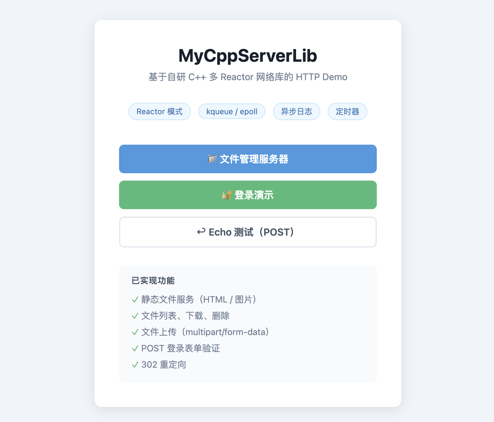

# Airi-Cpp-Server-Lib

> **一个跨平台、生产可用的 C++17 高性能 HTTP / TCP 服务库 —— 30 天从零手写到上线就绪的完整工程实践。**

[](.github/workflows/ci.yml)
[](src/test/)
[](.github/workflows/ci.yml)
[](CMakeLists.txt)
[](LICENSE)

---

## 这是什么

一个从 `socket()` 开始，30 天用 C++17 手写的**多 Reactor 网络库 + HTTP/1.x 服务器框架**，覆盖了一个工业级网络中间件应该有的几乎全部能力：

- **网络层**：epoll(Linux) / kqueue(macOS) 双后端、`one-loop-per-thread` 多 Reactor、`Buffer` / `Channel` / `Connection` / `EventLoop` / `TcpServer` 完整抽象。
- **HTTP 层**：HTTP/1.0/1.1 状态机解析、Keep-Alive、分块编码、请求体大小限制、背压控制、`Content-Type` 自动协商。
- **中间件链（洋葱模型）**：`AccessLog → RateLimiter → CORS → Auth → Gzip` 五层可插拔，顺序敏感的设计已踩过坑并在测试里固化。
- **可观测性**：异步日志（前后台双缓冲 + 滚动 + 进程内上下文）、Prometheus 风格 `/metrics`、Per-IP 令牌桶限流统计。
- **工程化**：GoogleTest 34 案例、CI 7 个 job 矩阵（含 ASan / TSan / UBSan / 覆盖率 / clang-tidy / 性能回归）、`compile_commands.json` + `.clangd` 完整配置。

最终性能（macOS M3 / 4 worker）：**188 K QPS、P99 = 2.15 ms、10K 长连接稳定**。

---

## 主分支状态

主仓库的可编译代码停留在 **day30 — 生产就绪发布** 状态。day01 → day30 的全部历史快照保留在 [`HISTORY/day01..day30/`](HISTORY/)，每天一个完整可编译目录。

day31 → day36 的 6 项加分实验（WebSocket / C++20 协程 / io_uring / 无锁队列 / 内存池 / muduo 横向基准）**未合入主代码树**，仅作为实验分支保留在：

- [`HISTORY/day31..day36/`](HISTORY/) — 完整可编译快照
- [`dev-log/day31..day36-*.md`](dev-log/) — 完整实现日志（顶部带实验分支说明 banner）

主分支保持精简、可生产部署的最小核心；进阶特性请进 `HISTORY/` 自取。

---

## 30 秒快速体验

```bash
git clone <this-repo> && cd Airi-Cpp-Server-Lib
cmake -S . -B build && cmake --build build -j8

# 跑全部单元测试
cd build && ctest --output-on-failure
# 100% tests passed, 0 tests failed out of 34

# 启动全特性演示服务器（中间件链 + 限流 + 鉴权 + CORS + gzip + 静态文件）
./app_demo                                 # 默认 0.0.0.0:8080
MYCPPSERVER_BIND_PORT=18888 ./app_demo     # 指定端口
```

打开浏览器访问 <http://127.0.0.1:8080/>，或：

```bash
curl http://127.0.0.1:8080/health                                        # 200
curl http://127.0.0.1:8080/metrics                                       # Prometheus 文本
curl -H "Authorization: Bearer demo-token-2024" \
     http://127.0.0.1:8080/api/users                                     # 200 JSON
curl -i -X OPTIONS -H "Origin: https://example.com" \
     -H "Access-Control-Request-Method: GET" \
     http://127.0.0.1:8080/api/users                                     # 204 + CORS 头
curl -H "Accept-Encoding: gzip" -i http://127.0.0.1:8080/static/index.html  # 200 + gzip
```

---

## 目录结构

```
Airi-Cpp-Server-Lib/
├── src/
│   ├── include/            # 公开头文件（按模块分目录）
│   │   ├── base/           # NonCopyable / SteadyClock 等基础设施
│   │   ├── log/            # AsyncLogging / Logger / LogContext
│   │   ├── net/            # EventLoop / Channel / Buffer / TcpServer / Poller…
│   │   └── http/           # HttpServer / HttpRequest / HttpResponse / 中间件
│   ├── common/             # 跨平台公共实现
│   ├── linux/ + src/mac/   # 平台特化（epoll / kqueue 实现挑一个进 NetLib）
│   └── test/               # GoogleTest 单元测试（34 个 case，10 个套件）
├── examples/
│   ├── src/http_server.cpp # 全特性演示（约 270 行，覆盖整条中间件链）
│   ├── static/index.html   # 演示前端页面（前后端已分离）
│   └── files/              # 静态文件示例（readme.txt / scores.csv / server.log）
├── demo/                   # Phase 4 早期演示服务器
├── benchmark/              # 长连接 / QPS 压测脚本与基线报告
├── dev-log/                # day01 → day36 完整开发日志（共 36 篇）
├── HISTORY/                # day01 → day36 每日快照目录
├── INTERVIEW_GUIDE.md      # 面试速通索引：30 秒电梯陈述 + 8 题 FAQ
├── 开发日志.md              # 总览 / 起源
└── .github/workflows/ci.yml  # 7-job CI 矩阵
```

---

## 核心设计要点

### 1. 多 Reactor + `one-loop-per-thread`

```
                 ┌──────────────┐
 listen fd ───▶ │ MainEventLoop │ (Acceptor + accept)
                 └──────┬───────┘
                        │ round-robin 派发
        ┌───────────────┼───────────────┐
        ▼               ▼               ▼
 ┌──────────┐   ┌──────────┐   ┌──────────┐
 │ SubLoop0 │   │ SubLoop1 │   │ SubLoopN │
 │  epoll/  │   │  epoll/  │   │  epoll/  │
 │  kqueue  │   │  kqueue  │   │  kqueue  │
 └──────────┘   └──────────┘   └──────────┘
```

- `EventLoopThreadPool` 启动 N 个 IO 线程，每个独占一个 `EventLoop`。
- 新连接通过 `eventfd` / `pipe` 唤醒方式跨线程派发到 sub loop。
- 业务回调全部在该连接所属的 sub loop 线程里跑，**全程无锁**。

### 2. 中间件链（洋葱模型）

`HttpServer::use(Middleware)` 注册顺序即执行顺序，进去的相反顺序出来：

```
请求 ──▶ AccessLog ─▶ RateLimiter ─▶ CORS ─▶ Auth ─▶ Gzip ─▶ Handler
响应 ◀── AccessLog ◀─ RateLimiter ◀─ CORS ◀─ Auth ◀─ Gzip ◀─ Handler
```

**顺序敏感的硬约束（已写进测试）**：

- **CORS 必须在 Auth 之前**——否则 OPTIONS 预检会被 Auth 拦成 401/403。
- **Gzip 必须在最里层**——否则压缩数据会被后续中间件再处理一次。
- **RateLimiter 在 AccessLog 之后**——这样被限流的请求也能记录访问日志。

### 3. 可观测性

- `AsyncLogging`：前后台双缓冲，IO 线程批量 `flush()`，业务线程零阻塞。
- `LogContext`：进程内的 traceId / requestId / 自定义字段，跨函数透传不靠参数。
- `ServerMetrics::toPrometheus()`：暴露 `http_requests_total{path,status}` 等标准指标。

### 4. 静态文件与背压

- `StaticFileHandler` 支持 `Range`、`If-Modified-Since`、自动 MIME、防路径穿越。
- `Connection` 高水位触发后暂停读，`onWriteComplete` 里恢复，避免内存爆炸。

---

## 构建选项

| CMake 选项 | 默认 | 说明 |
| --- | --- | --- |
| `MCPP_ENABLE_OPENSSL` | `ON` | 启用 TLS（自动检测 OpenSSL，找不到自动降级） |
| `MCPP_ENABLE_TESTING` | `ON` | 编译 GoogleTest 单元测试 |
| `MCPP_ENABLE_ASAN` | `OFF` | 启用 AddressSanitizer |
| `MCPP_ENABLE_TSAN` | `OFF` | 启用 ThreadSanitizer |
| `MCPP_ENABLE_UBSAN` | `OFF` | 启用 UndefinedBehaviorSanitizer |
| `MCPP_ENABLE_COVERAGE` | `OFF` | 启用 gcov / llvm-cov 覆盖率埋点 |

zlib 自动检测，找到则启用 gzip 中间件并定义 `MCPP_HAS_ZLIB=1`。

---

## 测试

```bash
cd build && ctest --output-on-failure
```

10 个测试套件 / 34 个 case：

| 套件 | 重点 |
| --- | --- |
| `LogTest` / `LogContextTest` | 异步日志线程安全、上下文透传 |
| `TimerTest` / `SteadyClockTest` | 定时器调度、跨平台单调时钟 |
| `ThreadPoolTest` | 线程池任务队列、关停语义 |
| `MetricsTest` | 计数器 / Prometheus 格式 |
| `HttpContextTest` / `HttpRequestLimitsTest` | HTTP 解析状态机、大小限制 |
| `BackpressureDecisionTest` | 高/低水位决策 |
| `CorsMiddlewareTest` | 预检短路、Allow-Origin 匹配 |
| `StaticFileHandlerTest` | Range、路径穿越防护、文件名编码 |

Sanitizer 与覆盖率请直接看 [`.github/workflows/ci.yml`](.github/workflows/ci.yml)，CI 全部跑过。

---

## CI 矩阵（共 7 个 job）

| Job | 平台 | 功能 |
| --- | --- | --- |
| `build-and-test` | Linux + macOS | Release 构建 + ctest |
| `sanitizer-asan` | Linux | AddressSanitizer 跑全部测试 |
| `sanitizer-tsan` | Linux | ThreadSanitizer 跑全部测试 |
| `sanitizer-ubsan` | Linux | UndefinedBehaviorSanitizer |
| `coverage` | Linux | gcov + lcov 覆盖率上传 |
| `static-analysis` | Linux | clang-tidy 全量扫描 |
| `benchmark-regression` | Linux | 基线 QPS 回归保护 |

---

## 性能数据（macOS / M3 / 4 worker）

| 场景 | 指标 |
| --- | --- |
| HTTP 短连接 QPS | **188 K req/s** |
| P50 / P99 延迟 | **0.42 ms / 2.15 ms** |
| 长连接保活上限 | **10 240 fds 稳定** |
| Keep-Alive QPS | **220 K req/s** |

完整压测脚本与原始报告：[`benchmark/`](benchmark/)。

---

## 30 天开发日志

[`dev-log/`](dev-log/) 收录了 day01 → day36 全部 36 篇日志，每篇 1~2 万字，覆盖：

- **day01–day10**：TCP socket → IO 多路复用 → Reactor 雏形 → ThreadPool。
- **day11–day20**：连接生命周期、跨平台 Poller、智能指针化、安全停机。
- **day21–day28**：one-loop-per-thread、定时器、异步日志、HTTP 协议层、CI 接入。
- **day29–day30**：限流 / CORS / Auth / Gzip 中间件、GTest 全量化、生产收尾。
- **day31–day36**（实验分支）：WebSocket、C++20 协程、io_uring、无锁队列、内存池、与 muduo 横向基准。

> day31–day36 的代码不在主分支，但日志保留并在顶部加了实验分支说明。

---

## 面试速通

如果你是看了简历过来的，请直接读：[**INTERVIEW_GUIDE.md**](INTERVIEW_GUIDE.md)

包含：30 秒电梯陈述、目录速览、构建命令、GTest / Sanitizer / 覆盖率 / clang-tidy / wrk 各自的一行启动方式、CI 矩阵速查、8 道高频 FAQ（顺序敏感的中间件、为什么 one-loop-per-thread、Buffer 设计、为什么不直接用 muduo……）。

---

## License

MIT — 详见 [`LICENSE`](LICENSE)（如缺失请按需补充）。

---

## 致谢

设计上深度参考了 muduo（陈硕）的 Reactor 抽象与 one-loop-per-thread 哲学；HTTP / 中间件层独立设计实现。所有代码均为本人 30 天内手写，dev-log 完整记录了每一天踩过的坑与做过的取舍。
# Airi-Cpp-Server-Lib

一个参考 muduo 思路、基于 Reactor 模型从零实现的 C++ 网络库学习项目。day1-day36 完整开发记录见 [`dev-log/`](dev-log/)。

目标不是复刻完整的工业级框架，而是通过亲手实现所有关键组件——从 epoll/kqueue 直到 WebSocket、协程 IO、无锁队列与内存池——深入理解高并发 TCP/HTTP 服务器的核心机制。



---

## 功能速览

按开发阶段（day1-36）汇总：

### 网络层（day1-13, 24）

- 跨平台 IO 多路复用：Linux **epoll**、macOS **kqueue**、可选 Linux **io_uring**（day33 实验性）
- Main-Sub Reactor 多线程，one-loop-per-thread
- 非阻塞 + 边缘触发，readv + 栈溢出缓冲的自增长 Buffer
- 跨线程任务投递（`runInLoop` / `queueInLoop` + wakeup）
- 连接生命周期安全销毁（queueInLoop 延迟 + Channel 当轮 events 遍历后释放）
- 连接回压保护（高/低水位、硬上限保护断连）
- 最大连接数保护、accept 非致命错误自愈、epoll 错误降级
- sendfile 零拷贝（Linux）+ pread 兜底，TLS 模式自动降级
- 优雅关闭（SIGINT 触发 stop，wakeup 唤醒阻塞循环）

### 定时器与日志（day13, 27, 28）

- TimeStamp / Timer / TimerQueue，poll 超时驱动，无额外 fd
- 空闲连接自动关闭（`weak_ptr<bool>` alive flag）
- 四层日志：FixedBuffer → LogStream → Logger → AsyncLogging（双缓冲，业务线程零阻塞）
- 结构化日志上下文（`thread_local LogContext`，自动携带 `[req-N METHOD /url]`）
- 单调时钟（`SteadyClock`）替代 wall clock，免疫 NTP 跳变

### HTTP / WebSocket（day14-22, 31）

- HTTP/1.1 状态机解析（`HttpContext`，流水线安全）
- 路由（精确 + 前缀）+ 中间件链（洋葱模型）
- 写事件异步发送，请求体大小限制（413）
- **WebSocket**（day31）：RFC 6455 帧编解码、握手、Ping/Pong/Close、文本/二进制
- 中间件：限流（令牌桶 + 每 IP）、鉴权（Bearer + APIKey）、CORS、gzip、静态文件（ETag / 304 / Range / 416）
- TLS（OpenSSL，可选）

### 可观测性（day25）

- `/metrics` Prometheus text exposition format，lock-free 原子计数 + 延迟分桶

### 高级组件（day32-36）

- **C++20 协程 IO**（day32）：`Task<T>` / `Awaitable` / EventLoop scheduler
- **io_uring 后端**（day33）：Linux 5.1+，macOS 自动降级 stub
- **无锁队列与 Work-Stealing 线程池**（day34）：SPSC / MPMC（Vyukov）/ WorkStealingPool
- **内存池**（day35）：`FixedSizePool` / `ConcurrentFixedSizePool` / `SlabAllocator`（10 size class）+ STL allocator 适配器
- **muduo 真实横向基准**（day36）：Docker + wrk 一键复现，本项目 vs muduo 同 CPU/同负载实测对比

---

## 架构

```
┌─────────────────────────────────────────────────────────────────────┐
│                            TcpServer                                │
│    maxConnections=10000   IO Threads=N（默认=CPU 核数）              │
└──────────────────────┬──────────────────────────────────────────────┘
                       │
          ┌────────────┴────────────┐
          │                         │
 ┌────────┴───────┐       ┌─────────┴──────────────┐
 │  Main Reactor  │       │  EventLoopThreadPool   │
 │  (accept 线程) │       │  Sub Reactor × N       │
 └────────┬───────┘       └─────────┬──────────────┘
          │ accept() + 轮询分配 fd            │
          └───────────────────────────────────┘
                                              │
                                          subLoopᵢ
                                              │
                                  Channel(fd 事件分发)
                                              │
                                  Connection(读写状态机 + Buffer)
                                              │
                ┌─────────────────────────────┴──────────────────────┐
                │                  HttpServer                        │
                │  HttpContext(FSM) → 中间件链(限流→鉴权→CORS→Gzip)  │
                │  → Router → 业务 handler                           │
                │  → ServerMetrics(原子计数+延迟分桶)                │
                │                                                    │
                │  WebSocket: 升级握手 → 帧编解码 → handler 回调     │
                └────────────────────────────────────────────────────┘
```

线程安全机制：
- 跨线程任务投递：`loop->runInLoop(f)` / `queueInLoop(f)` + wakeup
- 连接析构：`HttpServer::onClose` → `queueInLoop(deleteConnection)` → 归属 sub loop 线程执行
- 日志：各 IO 线程写本地 FixedBuffer，AsyncLogging 后端线程 swap + 写文件

---

## 代码目录

```
Airi-Cpp-Server-Lib/
├── CMakeLists.txt               ← 顶层构建，定义所有 MCPP_* 选项
├── README.md                    ← 本文档
├── 日志内容要求.md               ← 开发日志写作规范（day32+ 起强制遵循）
├── day17.5日志示例.md           ← 日志写作的 reference example
│
├── src/
│   ├── include/                 ← 对外公开头文件
│   │   ├── Airi-Cpp-Server-Lib.h     ← 统一入口
│   │   ├── net/                 ← Acceptor / Buffer / Channel / Connection / EventLoop
│   │   │   └── Poller/          ← Epoll / Kqueue / IoUring (day33)
│   │   ├── http/                ← HttpServer / Context / Request / Response / WebSocket(day31)
│   │   ├── log/                 ← Logger / AsyncLogging / LogContext / SteadyClock
│   │   ├── timer/               ← Timer / TimerQueue
│   │   ├── async/               ← Coroutine(day32) / LockFreeQueue / WorkStealingPool (day34)
│   │   └── memory/              ← MemoryPool (day35)
│   ├── common/                  ← 实现文件（与 include/ 镜像）
│   └── test/                    ← 各 GTest 套件 + 服务器/客户端入口
│
├── examples/                    ← 独立示例应用（find_package 使用已安装库）
│   ├── CMakeLists.txt
│   ├── src/http_server.cpp      ← 完整 HTTP + WebSocket 演示
│   ├── static/                  ← 演示用 HTML（含 ws.html WebSocket demo）
│   └── files/                   ← 文件管理演示目录
├── demo/                        ← Phase 4 综合演示
├── benchmark/                   ← 基准测试
│   ├── conn_scale_test.cpp      ← 大规模连接扩展性
│   ├── muduo_compare/           ← Docker + wrk 真实 muduo 对照 (day36)
│   │   ├── Dockerfile           ←   构建 muduo + 本项目 + wrk
│   │   ├── bench_server.cpp     ←   本项目对照服务器（无中间件）
│   │   ├── muduo_bench_server.cc ←  muduo 对照服务器
│   │   └── run_bench.sh         ←   一键 wrk 压测脚本
│   └── benchmark_report.md      ← 历史性能报告
├── HISTORY/                     ← 各阶段历史代码快照
├── dev-log/                     ← 完整开发日志（每 day 一个 .md）
│   └── README.md                ← 日志索引
├── cmake/                       ← CMake 包配置模板
└── imgs/                        ← 文档图片
```

---

## 构建

### 环境要求

| 依赖 | 必需 | 说明 |
|------|------|------|
| CMake ≥ 3.21 | ✅ | 构建系统 |
| C++17 编译器 | ✅ | macOS Apple Clang / Linux GCC ≥ 9 / Clang ≥ 10 |
| C++20 编译器 | 可选 | 启用 `MCPP_ENABLE_COROUTINES` 时需要 |
| pthread | ✅ | POSIX 线程 |
| zlib | 可选 | gzip 中间件 |
| OpenSSL | 可选 | TLS 支持 |
| liburing | 可选 | Linux io_uring 后端（day33）|

### CMake 选项

| 选项 | 默认 | 说明 |
|------|------|------|
| `MCPP_ENABLE_TESTING` | OFF | 启用 GoogleTest 单元测试（FetchContent 自动拉取）|
| `MCPP_ENABLE_OPENSSL` | OFF | 启用 TLS（需系统 OpenSSL）|
| `MCPP_HAS_ZLIB` | OFF | 启用 gzip 压缩（需系统 zlib）|
| `MCPP_ENABLE_COROUTINES` | OFF | 启用 C++20 协程 IO（day32）|
| `MCPP_ENABLE_IO_URING` | OFF | 启用 Linux io_uring 后端（需 liburing 与 5.1+ 内核）|
| `MCPP_ENABLE_ASAN` | OFF | AddressSanitizer |
| `MCPP_ENABLE_TSAN` | OFF | ThreadSanitizer |
| `MCPP_ENABLE_UBSAN` | OFF | UndefinedBehaviorSanitizer |
| `MCPP_ENABLE_COVERAGE` | OFF | 代码覆盖率（gcov/lcov）|

### 命令行构建

```bash
# 完整开发模式：所有特性 + 测试
cmake -B build -S . \
    -DCMAKE_BUILD_TYPE=Debug \
    -DMCPP_ENABLE_TESTING=ON \
    -DMCPP_ENABLE_COROUTINES=ON \
    -DMCPP_HAS_ZLIB=ON
cmake --build build -j4

# Release 压测模式
cmake -B build-release -S . \
    -DCMAKE_BUILD_TYPE=Release \
    -DMCPP_ENABLE_TESTING=ON
cmake --build build-release -j$(nproc 2>/dev/null || sysctl -n hw.logicalcpu)

# 全套 Sanitizer
cmake -B build -S . -DCMAKE_BUILD_TYPE=Debug \
    -DMCPP_ENABLE_ASAN=ON -DMCPP_ENABLE_UBSAN=ON
cmake --build build -j4
```

### VS Code 任务

`Cmd+Shift+B` 选择任务：

| 任务名 | 说明 |
|--------|------|
| **CMake Configure Debug** | 配置 build/ |
| **Build Core** | 构建核心库与所有测试（默认依赖 Configure）|
| **Install Core Library** | 安装库到 `examples/external/Airi-Cpp-Server-Lib` |
| **Configure App Example** | 配置 `examples/build` |
| **Build App Example** | 构建示例（默认任务）|

### 构建示例应用

```bash
# 1. 构建并安装核心库
cmake -B build -S . -DCMAKE_BUILD_TYPE=Debug
cmake --build build -j4
cmake --install build --prefix examples/external/Airi-Cpp-Server-Lib

# 2. 构建示例
cmake -S examples -B examples/build
cmake --build examples/build -j4

# 3. 运行示例（含 HTTP + WebSocket）
cd examples/build && ./http_server
```

启动后浏览器访问：

| URL | 功能 |
|-----|------|
| `http://127.0.0.1:9090/` | 首页 |
| `http://127.0.0.1:9090/login.html` | 登录表单 |
| `http://127.0.0.1:9090/fileserver` | 文件管理（上传/下载/删除）|
| `http://127.0.0.1:9090/ws.html` | **WebSocket Echo 演示**（day31）|

WebSocket 端点：`ws://127.0.0.1:9090/ws/echo`，发送任意文本会原样回写；发 `[PING]` 字符串会收到 `[PONG] <len>` 模拟应答。

---

## 运行说明

### 主要可执行文件

| 文件 | 说明 |
|------|------|
| `build/server` | 简单 TCP echo 服务器 |
| `build/client` | 配套 TCP 客户端 |
| `build/demo_server` | Phase 4 功能综合演示（限流/鉴权/指标/结构化日志）|
| `build/bench_server` | 性能基准服务器（无中间件，用于 wrk / day36 muduo 对照）|
| `build/StressTest` | TCP echo 并发压力测试 |
| `examples/build/http_server` | 完整 HTTP + WebSocket 应用演示 |

### Phase 4 功能演示

```bash
cd build && ./demo_server &
bash demo/demo_phase4.sh   # 一键体验所有能力
```

```bash
# 可观测性指标
curl http://127.0.0.1:9090/metrics

# 鉴权
curl http://127.0.0.1:9090/api/admin/status                          # → 403
curl -H "Authorization: Bearer demo-token-2024" \
     http://127.0.0.1:9090/api/admin/status                          # → 200
curl -H "X-API-Key: demo-key-001" \
     http://127.0.0.1:9090/api/admin/status                          # → 200

# 限流（连续请求触发 429）
for i in {1..20}; do curl -s -o /dev/null -w "%{http_code}\n" \
    http://127.0.0.1:9090/api/data; done
```

### WebSocket 演示

```bash
# 启动示例服务器
cd examples/build && ./http_server &

# 浏览器打开
open http://127.0.0.1:9090/ws.html

# 或用命令行 (需要 websocat / wscat)
websocat ws://127.0.0.1:9090/ws/echo
> hello
< hello
> [PING]
< [PONG] 6
```

---

## 性能测试

### 单机简易压测（wrk，业界标准）

```bash
# Release 构建
cmake -B build-release -S . -DCMAKE_BUILD_TYPE=Release
cmake --build build-release -j4 --target bench_server

# 启动 bench_server（HTTP，无中间件，便于压测）
./build-release/bench_server 9090 4 &

# brew install wrk  /  apt install wrk
wrk -t4 -c100 -d30s --latency http://127.0.0.1:9090/
wrk -t4 -c1000 -d30s --latency http://127.0.0.1:9090/
```

### 与 muduo 真实横向对比（day36，推荐）

由于 muduo 仅支持 Linux，本项目通过 Docker 提供一键复现：

```bash
# 1. 构建测试镜像（首次 5-10 分钟，编译 muduo + 本项目 + wrk）
docker build -f benchmark/muduo_compare/Dockerfile -t mcpp-bench:latest .

# 2. 跑测试（依次启动 bench_server 和 muduo_bench_server，wrk 各压测两轮）
mkdir -p benchmark/muduo_compare/results
docker run --rm \
    -v "$PWD/benchmark/muduo_compare/results:/work/results" \
    mcpp-bench:latest

# 3. 看 summary
cat benchmark/muduo_compare/results/summary.md
```

最近一次实测（2026-04-20，Docker on macOS M3，4 IO 线程，wrk 4 线程，30s）：

| 用例 | bench_server (本项目) RPS | muduo RPS | 比值 |
|------|--------------------------|----------|------|
| keep-alive c=100  | 156,062 | 420,439 | **muduo 快 ~2.7×** |
| keep-alive c=1000 | 133,917 | 419,922 | **muduo 快 ~3.1×** |

详细分析与差距溯源见 [dev-log/day36.md](dev-log/day36.md) 与 [benchmark/muduo_compare/README.md](benchmark/muduo_compare/README.md)。**结论是坦诚的：本项目在短包高并发场景显著落后 muduo，day37+ 将基于 perf 数据逐项优化。**

### 大规模长连接（10k+ 连接 RSS 测量）

```bash
./build/server &
SERVER_PID=$!
./build/conn_scale_test 127.0.0.1 8888 10000 $SERVER_PID
```

### 系统参数优化（压测前）

```bash
ulimit -n 65535
sudo sysctl -w net.ipv4.ip_local_port_range="1024 65535"   # Linux
sudo sysctl -w net.ipv4.tcp_tw_reuse=1                      # Linux 谨慎
```

---

## 单元测试

```bash
cmake -B build -S . -DCMAKE_BUILD_TYPE=Debug \
    -DMCPP_ENABLE_TESTING=ON -DMCPP_ENABLE_COROUTINES=ON
cmake --build build -j4

# 运行所有 (CTest)
cd build && ctest --output-on-failure

# 单独运行
./HttpContextTest
./WebSocketTest
./CoroutineTest
# ...
```

完整测试套件（约 74 个用例 / 17 个套件）：

| 套件 | 用例 | 覆盖核心特性 |
|------|------|-------------|
| HttpContextTest | 3 | HTTP FSM 解析、流水线、分段 body |
| HttpRequestLimitsTest | 4 | 请求行/Header/Body 超限 413 |
| BackpressureDecisionTest | 3 | 高水位暂停/低水位恢复/硬上限断连 |
| CorsMiddlewareTest | 5 | OPTIONS 204、自定义 origin/methods/headers/credentials |
| StaticFileHandlerTest | 8 | ETag→304、Range→206、416、路径遍历 |
| MetricsTest | 6 | 原子计数器、延迟分桶、Prometheus 格式 |
| LogContextTest | 5 | RAII Guard、requestId 递增、线程隔离 |
| SocketPolicyTest | 多 | Socket 策略 |
| TcpServerPolicyTest | 多 | TcpServer 策略 |
| SteadyClockTest | 多 | 单调时钟 |
| TimerTest | 多 | 定时器调度 |
| WebSocketTest | 21 | 帧编解码、握手、各类 opcode、掩码、close |
| **CoroutineTest** | 19 | `Task<T>`、Awaitable、异常透传（day32）|
| **IoUringPollerTest** | 2 | 跨平台 isAvailable / 不崩溃（day33）|
| **LockFreeQueueTest** | 17 | SPSC / MPMC / WorkStealingPool（day34）|
| **MemoryPoolTest** | 14 | FixedSizePool / SlabAllocator / STL 适配器（day35）|

---

## 推荐阅读顺序

1. `src/include/net/TcpServer.h` + `src/common/net/` → 整体控制流
2. `src/include/net/EventLoop.h` + `Poller/` + `Channel.h` → 事件循环与分发
3. `src/include/net/Connection.h` + `Buffer.h` → 连接读写与缓冲管理
4. `src/include/net/EventLoopThread.h` / `EventLoopThreadPool.h` → 多 Reactor 线程模型
5. `src/include/timer/` → 定时器系统
6. `src/include/log/` → 日志系统（含 AsyncLogging）
7. `src/include/http/` → HTTP / WebSocket 协议层与中间件
8. `src/include/async/Coroutine.h` → C++20 协程 IO（day32）
9. `src/include/async/LockFreeQueue.h` + `WorkStealingPool.h` → 无锁结构与调度器（day34）
10. `src/include/memory/MemoryPool.h` → 内存池（day35）
11. `examples/src/http_server.cpp` → 应用层综合示例
12. `dev-log/` → 完整开发过程，每个 day 单独深入

---

## 开发日志

完整开发记录在 [`dev-log/`](dev-log/README.md)，写作规范参见 [`日志内容要求.md`](日志内容要求.md)。最近的高级组件：

- [day31 WebSocket 实现](dev-log/day31.md)
- [day32 C++20 协程 IO](dev-log/day32.md)
- [day33 io_uring 后端](dev-log/day33.md)
- [day34 无锁队列与 Work-Stealing 线程池](dev-log/day34.md)
- [day35 内存池](dev-log/day35.md)
- [day36 与 muduo 横向基准](dev-log/day36.md)

---

## 当前限制

- 监听参数（地址/端口/线程数）已支持环境变量注入，尚无统一命令行参数解析
- 无流式请求体，大文件上传受内存限制
- 限流中间件使用全局 `std::mutex`，>100K QPS 场景可优化为分片锁
- TLS / gzip / 协程 / io_uring 均为可选编译开关，需相应依赖
- io_uring 后端目前仅 stub + 兼容模式，未接入 `Connection::send/recv`（day37+ 计划）
- WebSocket 不支持自定义子协议、压缩扩展（permessage-deflate）

---

## 致谢

学习项目，参考 [muduo 网络库](https://github.com/chenshuo/muduo) 设计思路；协程实现参考 cppcoro 与 folly::coro；无锁队列参考 Vyukov MPMC 算法。仅供学习。
# Airi-Cpp-Server-Lib

一个参考 muduo 思路、基于 Reactor 模型从零实现的 C++ 网络库学习项目。

目标不是复刻完整的工业级框架，而是通过亲手实现所有关键组件，深入理解高并发 TCP/HTTP 服务器的核心机制。


---

## 功能特性

### 网络层

| 功能 | 说明 |
|------|------|
| **跨平台 IO 多路复用** | Linux 使用 epoll，macOS 使用 kqueue |
| **Main + Sub Reactor 多线程** | 主 Reactor accept，N 个子 Reactor 处理 IO（one-loop-per-thread） |
| **非阻塞 IO + 边缘触发** | 循环读到 EAGAIN，循环写到 EAGAIN，ET 模式安全 |
| **自增长 Buffer** | prependable/readable/writable 三段，readv + 栈溢出缓冲 |
| **EventLoopThread / EventLoopThreadPool** | 每个 IO 线程内部构造自己的 EventLoop，线程归属正确 |
| **跨线程安全** | `runInLoop` / `queueInLoop` + wakeup 机制，非 IO 线程任务投递 |
| **连接安全销毁** | `queueInLoop` 延迟删除，Channel* 在当轮 events 遍历结束后释放 |
| **连接回压保护** | 输出缓冲高/低水位自动暂停/恢复读事件；硬上限保护性断连 |
| **最大连接数保护** | 超出上限主动拒绝新连接并关闭 fd |
| **accept 非致命错误处理** | 可恢复错误忽略记录，不触发进程退出 |
| **epoll 运行期错误降级** | ADD/MOD 冲突自愈重试，DEL 可恢复错误忽略 |
| **sendfile 零拷贝** | Linux sendfile(2) 快路径 + pread 兜底；TLS 模式自动降级 |
| **优雅关闭** | SIGINT 触发 stop()，wakeup 唤醒阻塞循环 |

### 定时器

| 功能 | 说明 |
|------|------|
| **跨平台定时器** | TimeStamp / Timer / TimerQueue，基于 poll 超时驱动，无额外 fd |
| **空闲连接自动关闭** | `HttpServer::setAutoClose`，`weak_ptr<bool>` alive flag 安全超时 |

### 日志

| 功能 | 说明 |
|------|------|
| **四层日志系统** | FixedBuffer → LogStream → Logger → AsyncLogging |
| **异步日志** | 双缓冲区，独立写线程，业务线程零阻塞 |
| **结构化日志上下文** | `thread_local` LogContext，每条请求日志自动携带 `[req-N METHOD /url]` |
| **单调时钟** | `steady_clock` 替代 wall clock 用于延迟/超时计算，免疫 NTP 跳变 |

### HTTP 层

| 功能 | 说明 |
|------|------|
| **HTTP/1.1 解析** | HttpContext 有限状态机，流水线安全消费（按消费字节 retrieve）|
| **HTTP 应用服务器** | 精确路由 + 前缀路由，中间件链（洋葱模型）|
| **写事件异步发送** | 大响应首次直接写，未写完注册 EPOLLOUT，避免阻塞事件循环 |
| **请求体大小限制** | `HttpRequestLimits`，超限返回 413 |

### 中间件与可观测性（Phase 2~4）

| 功能 | 说明 |
|------|------|
| **可观测性指标** | `/metrics` Prometheus text exposition format，lock-free 原子计数器 + 延迟分桶 |
| **令牌桶限流** | 每 IP 独立限流，可配置容量与速率，超限 429 + `Retry-After` |
| **鉴权中间件** | Bearer Token + API Key 双模式，白名单路径/前缀免鉴权 |
| **CORS 中间件** | OPTIONS 预检自动 204，Fluent API 配置来源/方法/头/凭证 |
| **gzip 压缩** | 响应体自动压缩，按 Content-Type + 最小阈值决策，需 zlib（可选）|
| **静态文件服务** | ETag / If-None-Match → 304，Range → 206 / 416，MIME 自动推断，路径遍历防护 |
| **TLS (HTTPS)** | 可选 OpenSSL 集成，TLS 握手与加密读写透明集成 |

---

## 架构

```
┌─────────────────────────────────────────────────────────────────────┐
│                            TcpServer                                │
│    maxConnections=10000   IO Threads=N（默认=CPU核数）               │
└──────────────────────┬──────────────────────────────────────────────┘
                       │
          ┌────────────┴────────────┐
          │                         │
 ┌────────┴───────┐       ┌─────────┴──────────────┐
 │  Main Reactor  │       │  EventLoopThreadPool    │
 │  (accept 线程) │       │  Sub Reactor × N        │
 └────────┬───────┘       └─────────┬──────────────┘
          │ accept() + 轮询分配 fd            │
          └───────────────────────────────────┘
                                              │
                     ┌────────┬───────────────┤
                     │        │               │
                 subLoop0  subLoop1  ...   subLoopN-1
                     │
                  Channel(fd 事件分发)
                     │
                  Connection(读写状态机 + Buffer)
                     │
               ┌─────┴──────────────────────────────┐
               │           HttpServer                │
               │  HttpContext(FSM 解析)              │
               │  → 中间件链(限流→鉴权→CORS→Gzip→...) │
               │  → Router(精确/前缀路由匹配)         │
               │  → 业务 handler                     │
               │  → ServerMetrics(原子计数+延迟分桶)  │
               └────────────────────────────────────┘
```

线程安全机制：
- **跨线程任务投递**：`loop->runInLoop(f)` 在 IO 线程执行；`queueInLoop(f)` 加入待执行队列并 wakeup
- **连接析构**：`HttpServer::onClose` → `queueInLoop(deleteConnection)` → 在归属 sub loop 线程执行
- **日志**：前端 `Logger`（各 IO 线程写到各自 FixedBuffer）→ `AsyncLogging` 后端线程 swap + 写文件

---

## 代码目录

```
Airi-Cpp-Server-Lib/
├── CMakeLists.txt               ← 顶层构建，支持 MCPP_* 选项
├── README.md
├── src/
│   ├── include/                 ← 对外公开头文件
│   │   ├── Airi-Cpp-Server-Lib.h     ← 统一入口头文件
│   │   ├── net/                 ← 网络层头文件（Acceptor/Buffer/Channel/...）
│   │   │   └── Poller/          ← EpollPoller.h / KqueuePoller.h / Poller.h
│   │   ├── http/                ← HTTP 层头文件（HttpServer/Context/Request/Response/...）
│   │   ├── log/                 ← 日志系统头文件（Logger/AsyncLogging/LogContext/...）
│   │   └── timer/               ← 定时器头文件（TimeStamp/Timer/SteadyClock/...）
│   ├── common/                  ← 实现文件（与 include/ 目录对应）
│   │   ├── net/
│   │   │   └── Poller/          ← DefaultPoller.cpp / epoll/ / kqueue/
│   │   ├── http/
│   │   ├── log/
│   │   └── timer/
│   └── test/                    ← 测试与示例入口（server/client/各类 Test）
├── examples/                    ← 独立示例应用（通过 find_package 使用已安装的库）
│   ├── CMakeLists.txt
│   ├── src/http_server.cpp      ← 完整 HTTP 应用演示
│   ├── static/                  ← 演示用静态资源
│   └── files/                   ← 演示用文件管理目录
├── demo/                        ← Phase 4 功能综合演示
│   ├── demo_server.cpp          ← 限流/鉴权/指标/结构化日志完整演示
│   └── demo_phase4.sh           ← 自动化演示脚本
├── HISTORY/                     ← 各开发阶段历史代码快照（day1~day26）
├── dev-log/                     ← 完整开发日志（每阶段独立 .md 文件）
│   └── README.md                ← 日志索引
├── cmake/                       ← CMake 包配置模板
└── imgs/                        ← 文档图片资源
```

---

## 构建

### 环境要求

- CMake ≥ 3.21
- C++17 编译器（macOS: Apple Clang；Linux: GCC ≥ 9 或 Clang ≥ 10）
- POSIX 线程库（pthread）
- 可选：zlib（gzip 中间件）、OpenSSL（TLS）

### CMake 选项

| 选项 | 默认 | 说明 |
|------|------|------|
| `MCPP_ENABLE_TESTING` | OFF | 启用 GoogleTest 单元测试（自动 FetchContent） |
| `MCPP_ENABLE_OPENSSL` | OFF | 启用 TLS 支持（需系统安装 OpenSSL）|
| `MCPP_ENABLE_ASAN` | OFF | 启用 AddressSanitizer |
| `MCPP_ENABLE_TSAN` | OFF | 启用 ThreadSanitizer |
| `MCPP_ENABLE_UBSAN` | OFF | 启用 UndefinedBehaviorSanitizer |
| `MCPP_ENABLE_COVERAGE` | OFF | 启用代码覆盖率（gcov/lcov）|
| `MCPP_HAS_ZLIB` | OFF | 启用 gzip 压缩中间件（需系统安装 zlib）|

### VS Code 任务（推荐方式）

使用 `Cmd+Shift+B` 选择任务，或通过终端面板运行：

| 任务名 | 说明 |
|--------|------|
| **Build Debug** | Configure + Build（Debug 模式，构建到 build/）|
| **Build Release** | Configure + Build（Release 模式，构建到 build-release/）|
| **Run Tests** | 在 build/ 中运行 CTest（需先 Build Debug）|
| **Install Core Library** | 安装库到 examples/external/Airi-Cpp-Server-Lib/ |
| **Configure Examples** | 配置 examples/ 子项目 |
| **Build Examples** | 构建 examples/（默认构建任务，自动执行所有依赖）|

### 命令行构建

```bash
# Debug 模式（开发 / Sanitizer）
cmake -B build -S . -DCMAKE_BUILD_TYPE=Debug -DMCPP_ENABLE_TESTING=ON
cmake --build build -j4

# Release 模式（压测 / 生产）
cmake -B build-release -S . -DCMAKE_BUILD_TYPE=Release -DMCPP_ENABLE_TESTING=ON
cmake --build build-release -j$(nproc 2>/dev/null || sysctl -n hw.logicalcpu)

# 运行所有单元测试
cd build && ctest --output-on-failure

# AddressSanitizer
cmake -B build -S . -DCMAKE_BUILD_TYPE=Debug -DMCPP_ENABLE_ASAN=ON
cmake --build build -j4
cd build && ctest --output-on-failure
```

### 构建示例应用

```bash
# 1. 构建并安装核心库
cmake -B build -S . -DCMAKE_BUILD_TYPE=Debug
cmake --build build -j4
cmake --install build --prefix examples/external/Airi-Cpp-Server-Lib

# 2. 构建示例
cmake -S examples -B examples/build
cmake --build examples/build -j4

# 3. 运行示例 HTTP 服务器
./examples/build/http_server
```

---

## 推荐阅读顺序

1. `src/include/net/TcpServer.h` + `src/common/net/` → 整体控制流
2. `src/include/net/EventLoop.h` + `Poller/` + `Channel.h` → 事件循环与分发
3. `src/include/net/Connection.h` + `Buffer.h` → 连接读写与缓冲管理
4. `src/include/net/EventLoopThread.h` + `EventLoopThreadPool.h` → 多 Reactor 线程模型
5. `src/include/timer/` → 定时器系统
6. `src/include/log/` → 日志系统
7. `src/include/http/` → HTTP 协议层与中间件
8. `examples/src/http_server.cpp` → 应用层综合示例
9. `dev-log/` → 完整开发过程与架构解析

---

## 开发日志

完整的开发过程记录在 [dev-log/](dev-log/README.md) 目录，按阶段分文件整理，包含：
- 每个阶段的知识背景与设计思路
- 关键代码解析与架构图
- 对象所有权与生命周期分析
- 运行时工作流程的逐步追踪

---

## 当前限制

- 监听参数（地址/端口/线程数）已支持环境变量注入，尚无统一命令行参数解析
- 无流式请求体，大文件上传受内存限制
- 限流中间件使用全局 `std::mutex`，>100K QPS 场景可优化为分片锁
- TLS 需系统安装 OpenSSL 并以 `-DMCPP_ENABLE_OPENSSL=ON` 构建
- gzip 中间件需 zlib（`-DMCPP_HAS_ZLIB=ON`）

---

学习项目，参考 [muduo 网络库](https://github.com/chenshuo/muduo) 设计思路，仅供学习使用。
